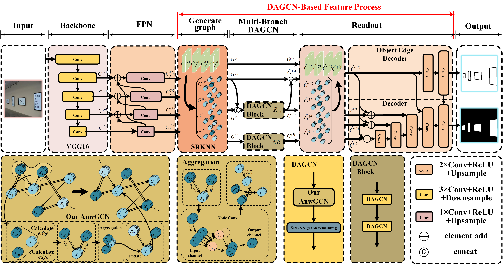

# DAGCN: Dynamic and Adaptive Graph Convolutional Network for Salient Object Detection

This is code repository for the paper: [DAGCN: Dynamic and Adaptive Graph Convolutional Network for Salient Object Detection](https://ieeexplore.ieee.org/document/9947338).

## Abstract

Deep learning-based salient object detection has
achieved significant success in recent years. The salient object
detection focuses on the context modeling of the scene information, and how to effectively model the context relationship
in the scene is the key. However, it is difficult to build an
effective context structure and model it. In this paper, we propose
a novel salient object detection method called DAGCN that
is composed of two parts, adaptive neighborhood-wise graph
convolutional network (AnwGCN) and spatially-restricted Knearest neighbors (SRKNN). The AnwGCN is novel adaptive
neighborhood-wise graph convolution, which is used to model
and analyze the saliency context. The SRKNN constructs the
topological relationship of the saliency context by measuring the
non-Euclidean spatial distance within a limited range. The proposed method constructs the context relationship as a topological
graph by measuring the distance of the features in the nonEuclidean space, and conducts comparative modeling of context
information through AnwGCN. The model has the ability to
learn the metrics between features and can adapt to the hidden
space distribution of the data. The description of the feature
relationship is more accurate. Through the convolutional kernel
adapted to the neighborhood, the model obtains the structure
learning ability. Therefore the graph convolution process can
adapt to different graph data. Experimental results demonstrate
that our solution achieves satisfactory performance on six widely
used datasets and can also effectively detect camouflaged objects.



## Citation

```
@ARTICLE{9947338,
  author={Li, Ce and Liu, Fenghua and Tian, Zhiqiang and Du, Shaoyi and Wu, Yang},
  journal={IEEE Transactions on Neural Networks and Learning Systems}, 
  title={DAGCN: Dynamic and Adaptive Graph Convolutional Network for Salient Object Detection}, 
  year={2022},
  volume={},
  number={},
  pages={1-15},
  doi={10.1109/TNNLS.2022.3219245}}
```